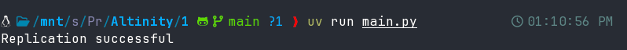
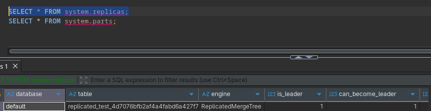
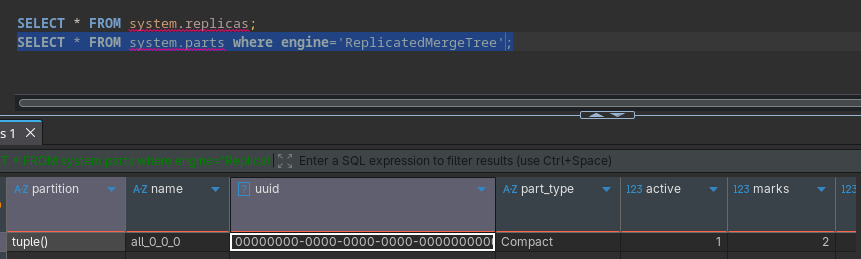
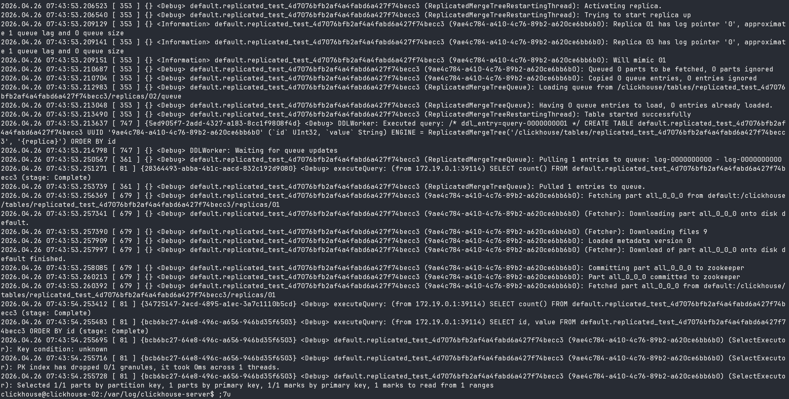

## Replication Setup

1. Single table, replicated on entire cluster.
2. Inserted data in CH via client connected to server 1.
3. Wait for some time, then query with client connected to server 2 for the data.

## Deliverables
1. [Setup](../setup)
2. Replication successful

    
3. System Replicas

    
4. System Parts

    
5. Replica Server Log

    

## References
- https://clickhouse.com/docs/engines/table-engines/mergetree-family/replication