## Logs Setup

## Deliverables
1. Optmized queries for
    - Error counts per service
        ```sql
        select service_name, count() as error_count
        from logs
        prewhere log_level =  'ERROR'
        group by service_name
        order by error_count desc;
        ```

        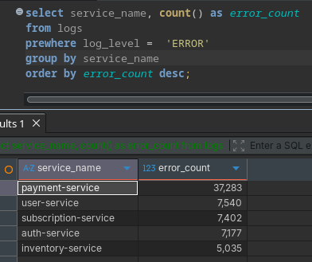  
    - Traffic per host
        ```sql
        select host, count() as host_count
        from logs
        group by host
        order by host_count desc;
        ```

        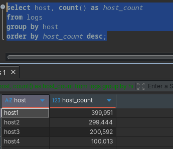
    - Logs over time (histogram / grouped per hour)
        ```sql
        select toStartOfHour(timestamp) as hour, count() as logs_per_hour
        from  logs
        group by hour
        order by hour;
        ```

        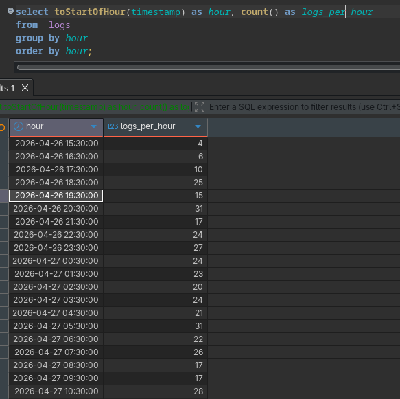

2. Enabling `log_queries` and monitoring
    - Enabling log
            ```sql
            SET log_queries = 1;
            SYSTEM FLUSH LOGS;
            ```
        -  Monitoring Query
            ```sql
            SELECT
            query,
            query_duration_ms,
            read_rows,
            read_bytes
            FROM system.query_log
            WHERE type = 'QueryFinish'
            ORDER BY event_time DESC
            LIMIT 5;
            ```

            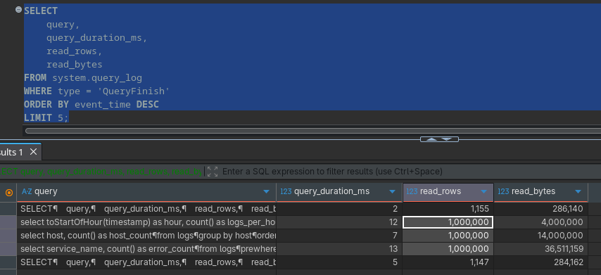
        - Almost all the queries are scanning all 1 million rows
    - Explaining the queries
        - Error counts per service

            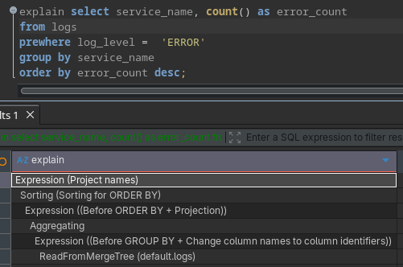

        - Traffic per host

            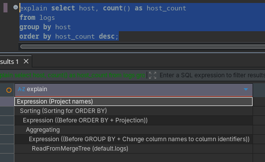
        
        - Logs over time (histogram / grouped per hour)

            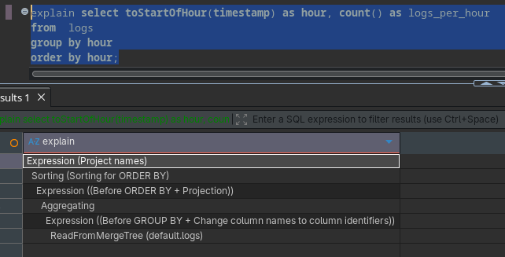
    - Almost all the queries end up scanning all rows, without optimizings

For optimizing the analytical queries, I explored two approaches:

1. Projections
2. SummingMergeTree with Materialized Views

While projections provide automatic query optimization, they are best suited for predictable query patterns and may not always provide the desired performance improvements for aggregation-heavy workloads.


### Tradeoffs

- Materialized Views:
  - Pros: Faster query performance due to pre-aggregation
  - Cons: Increased storage usage and slightly more complex ingestion pipeline

- Projections:
  - Pros: Simpler to manage, transparent to queries
  - Cons: Less control over aggregation strategy, performance gains were lower in this case

- Improvements
    - Projections
        ```sql
        alter table logs add projection p_service_errors
        (
            select service_name, countIf(log_level = 'ERROR') AS error_count
            GROUP BY service_name
        );

        alter table logs materialize projection p_service_errors;
        ```
        Rows scanned 
        
        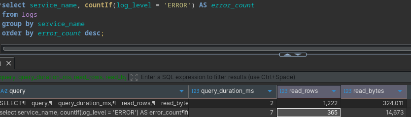 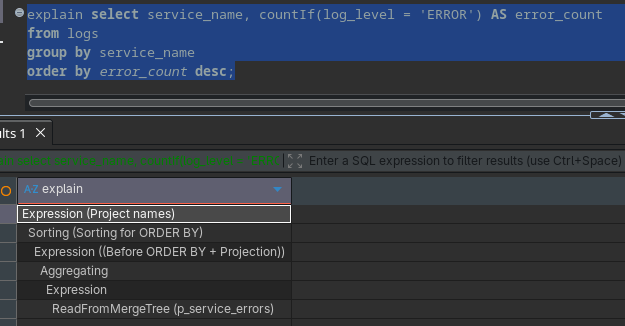
        ```sql
        alter table logs add projection p_host
        (
            select host, count() as host_count
            group by host
        );

        alter table logs materialize projection p_host;
        ```
        Rows scanned 
        
        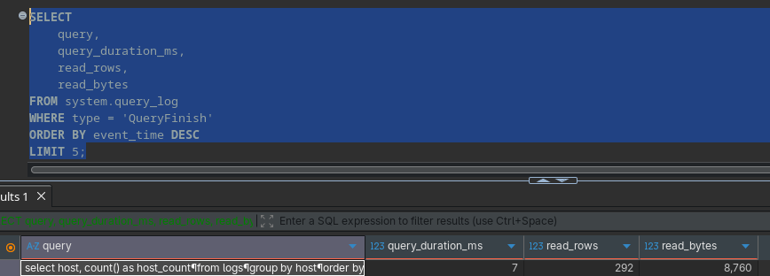 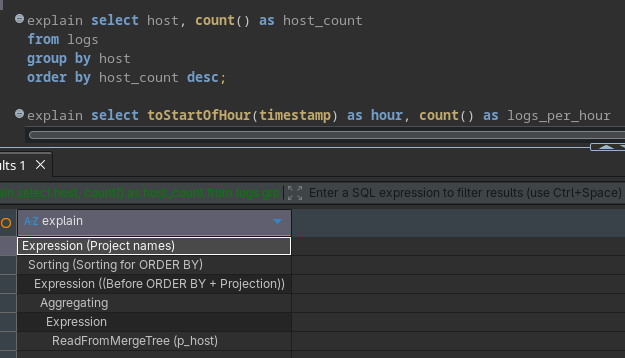
        ```sql
        alter table logs add projection p_logs_hist
        (
            select toStartOfHour(timestamp) as hour, count() as logs_per_hour
            group by hour
        );

        alter table logs materialize projection p_logs_hist;
        ```
        Rows scanned 
        
        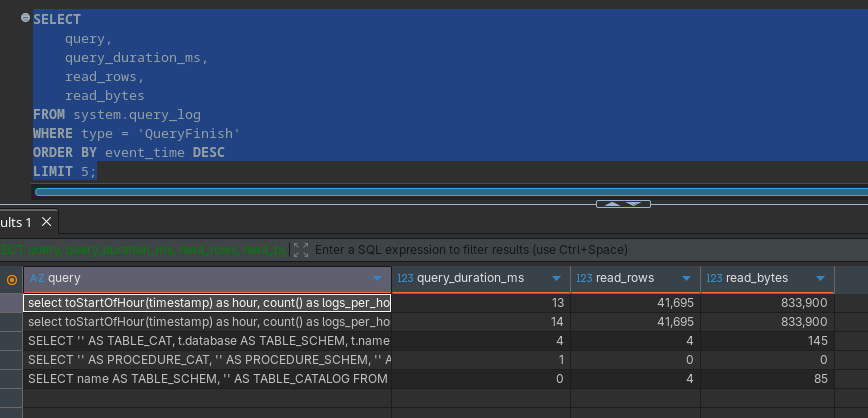 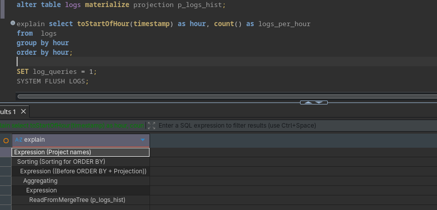
    - Summing Merge Tree
        ```sql
        CREATE TABLE logs_service_errors
        (
            service_name String,
            error_count UInt64
        )
        ENGINE = SummingMergeTree
        ORDER BY service_name;

        CREATE MATERIALIZED VIEW logs_service_errors_mv
        TO logs_service_errors
        AS
        SELECT
            service_name,
            countIf(log_level = 'ERROR') AS error_count
        FROM logs
        GROUP BY service_name;

        CREATE TABLE logs_host
        (
            host String,
            host_count UInt64
        )
        ENGINE = SummingMergeTree
        ORDER BY host;

        CREATE MATERIALIZED VIEW logs_host_mv
        TO logs_host
        AS
        SELECT
            host,
            count() AS host_count
        FROM logs
        GROUP BY host;


        CREATE TABLE logs_hour
        (
            hour DateTime,
            logs_per_hour UInt64
        )
        ENGINE = SummingMergeTree
        ORDER BY hour;


        CREATE MATERIALIZED VIEW logs_hour_mv
        TO logs_hour
        AS
        SELECT
            toStartOfHour(timestamp) AS hour,
            count() AS logs_per_hour
        FROM logs
        GROUP BY hour;

        select * from logs_host;

        select * from logs_hour;

        select * from logs_service_errors;
        ```
        - Query Improvments 
            
            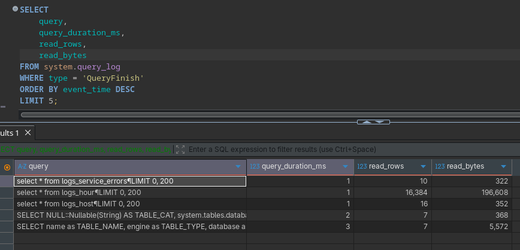
        - Scans way less rows using a SummingMergeTree along with a materialized view.


### References
- https://clickhouse.com/docs/sql-reference/statements/alter/projection
- https://clickhouse.com/docs/engines/table-engines/mergetree-family/summingmergetree