# 
1. Verifying initial data accross replicas
    - 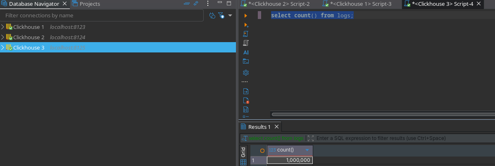
2. Stopping server 2
    - 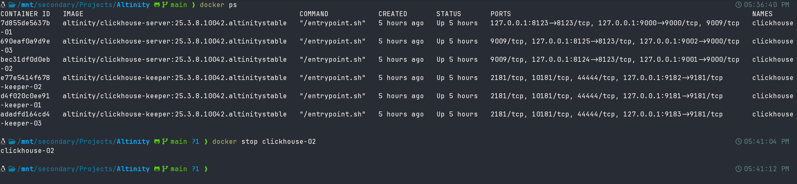
3. Inserting data while server 2 is down
    - Inserting random seed data, which creates many parts
    ```sql
    INSERT INTO logs
    SELECT
        now(),
        'auth-service',
        concat('host', toString(rand()%10)),
        'INFO',
        toString(rand())
    FROM numbers(100_000_000);
    ```
    - 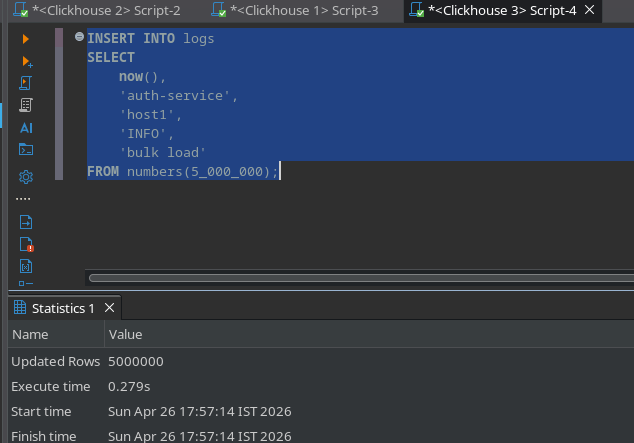
    - 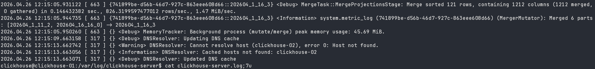
    - 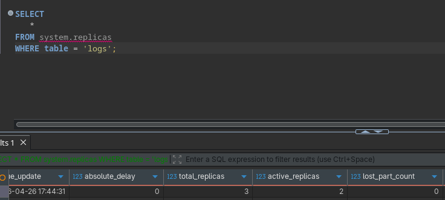
    - Altering tables for mutations
    ```sql
    ALTER TABLE logs
    UPDATE log_level = 'ERROR'
    WHERE service_name = 'auth-service';

    ALTER TABLE logs
    DELETE WHERE log_level = 'WARN';

    ALTER TABLE logs
    UPDATE message = 'fixed message'
    WHERE log_level = 'ERROR';
    ```
4. Bringing back server 2
    -  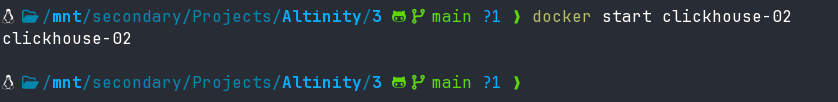
    -  Checking replication queue
        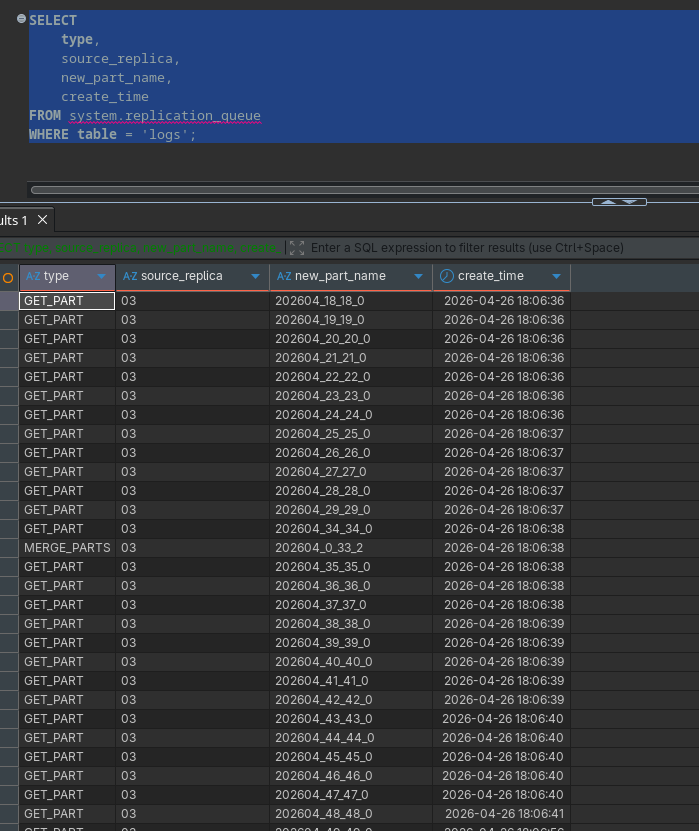
    - Checking replicas
        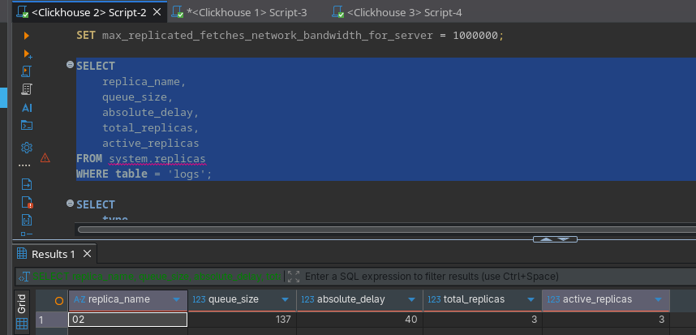
    - Checking mutations
        
    - Post mutation complete
        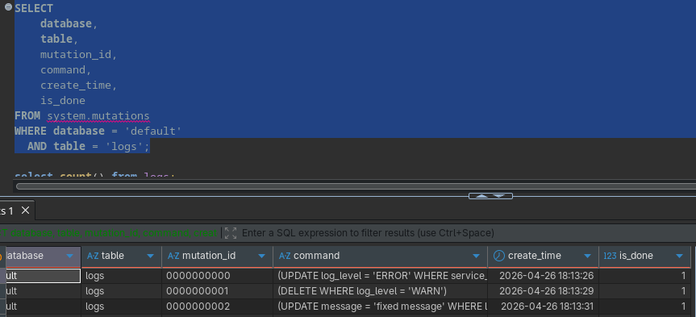
5. Checking consistency post operations
    - Server 1
        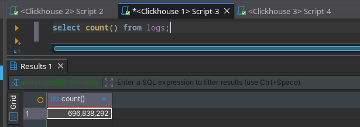
    - Server 2
        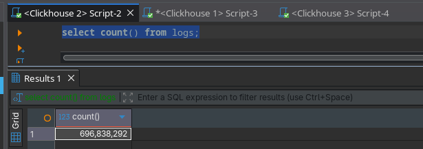
    - Server 3
        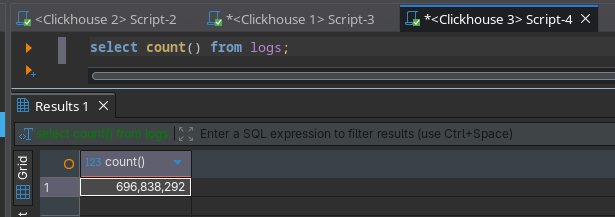