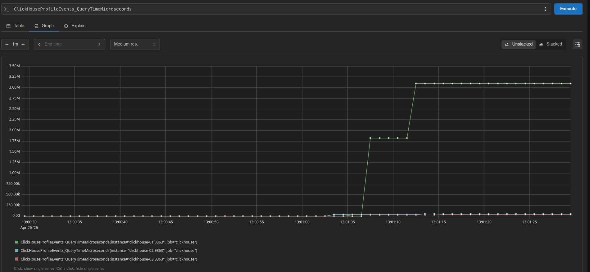
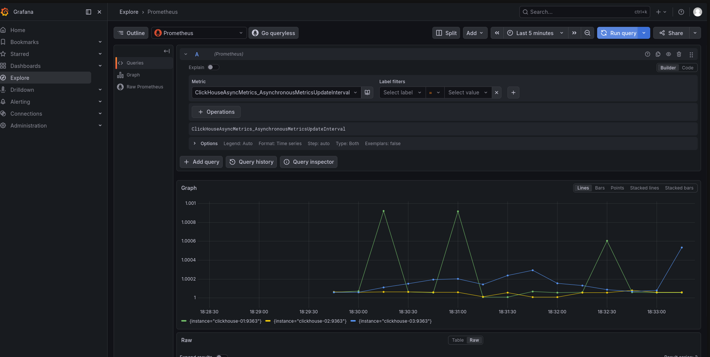

1. Enable prometheus metrics on servers
    ```
        <prometheus>
            <endpoint>/metrics</endpoint>
            <port>9363</port>
            <metrics>true</metrics>
            <events>true</events>
            <asynchronous_metrics>true</asynchronous_metrics>
        </prometheus>
    ```
2. Adding prometheus and grafana config
    - Prometheus
        ```
        global:
        scrape_interval: 5s

        scrape_configs:
        - job_name: 'clickhouse'
            static_configs:
            - targets:
                - 'clickhouse-01:9363'
                - 'clickhouse-02:9363'
                - 'clickhouse-03:9363'
        ```
    - Grafana
        ```
        apiVersion: 1

        datasources:
        - name: Prometheus
            type: prometheus
            access: proxy
            url: http://prometheus:9090
            isDefault: true
        ```
    - Docker compose
        ```
        prometheus:
            image: prom/prometheus
            container_name: prometheus
            volumes:
            - ./prometheus.yml:/etc/prometheus/prometheus.yml
            ports:
            - "127.0.0.1:9090:9090"
            depends_on:
            - clickhouse-01
            - clickhouse-02
            - clickhouse-03

        grafana:
            image: grafana/grafana
            container_name: grafana
            ports:
            - "127.0.0.1:3000:3000"
            volumes:
            - ./grafana/provisioning:/etc/grafana/provisioning
            depends_on:
            - prometheus
        ```
3. Metrics scraping and grafana
    - 
    - 